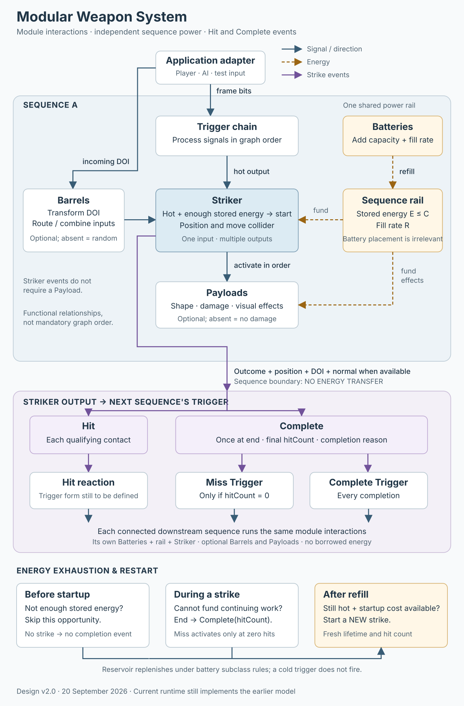

# Modular Weapon System — Design Specification v2.0

**Status:** design draft; agreed rules plus explicitly identified open decisions.

**Updated:** 20 September 2026.

**Implementation status:** a playable v2 subset is available in the F8 bench,
including sequence reservoirs, all Trigger subclasses, strike events and editable
prototype weapons. The survival game still uses legacy graphs. See
[implementation status](MWS_Implementation.md) for test instructions, supported
subclasses and prototype choices. This document specifies the target design,
not a claim of full implementation.

This is the local successor to the v1.1 specification at
`/Users/joewheeler/Dev/ShmupRouge/Love2D/docs/entities/Modular_Weapon_System.md`.
Where the two disagree, this document describes the intended direction for
game-dev-playground. The original document is unchanged.

[Module interaction flow chart (SVG)](diagrams/modular-weapon-system.svg)



## 1. Purpose and possible uses

MWS constructs weapon behavior from connected module instances. It should support
three possible uses without committing the core to one acquisition model:

1. Players find or buy preconfigured module instances and assemble weapons.
2. A creative mode exposes configuration for free experimentation.
3. Developers, including AI-assisted development tools, author complete weapons
   within a consistent set of module and energy rules.

Acquisition, pricing, permitted edits, and which modules are exposed are policies
of the surrounding game or tool. Loot rarity for all module families is a
possibility, not a settled requirement. Battery tiers are described below.

Weapons broadly support **impact** behavior (damage at a particular point) and
**AOE** behavior (damage over time within an area, including beams and fields).
These are descriptions of behavior, not additional module classes or a settled
requirement that a weapon belong exclusively to one category.

## 2. Classes, subclasses, and instances

The five module classes in this revision are:

| Class | Responsibility |
|---|---|
| Trigger | Process signals, timing, and sensor/event conditions to govern when strikes are requested. |
| Battery | Store energy and supply a sequence's power rail. |
| Barrel | Transform the direction of input and route or combine inputs/outputs. |
| Striker | Position and move colliders, activate payloads, and report hits and completion. |
| Payload | Define effect shape, damage, and visuals during a strike, at impact, or on completion. |

A **class** defines a role. A **subclass** defines a behavior, such as Repeater
Trigger, Ammo Battery, or Sweep Striker. An **instance** is a configured module
placed in a weapon graph. Instance configuration and runtime state are distinct:
for example, battery capacity is configuration; currently stored energy is state.

The authoring model needs instance-specific configuration and state. It does not
prescribe a programming-language inheritance mechanism or a serialization format.
Class/subclass declarations should remain the single source for properties,
defaults, editor controls, and validation, following the project's existing
schema-driven approach.

Repeater is now a Trigger subclass. **Emitter is retired from the revised model.**
Its former use cases are expressed through sequences: Triggers govern activation,
Batteries supply energy, Strikers perform the work, and Payloads define effects.
Further sequences can react to the resulting strike events. A separate Emitter
module and its special fire-and-forget execution path are unnecessary.

## 3. Weapon graphs and sequences

A weapon graph contains one or more **sequences**. A sequence is a distinct
subsection with its own power rail.

- Each sequence requires at least one Trigger, Battery, and Striker.
- Barrels and Payloads are optional.
- Without a Barrel, firing direction is random and ignores the incoming DOI.
- Without a Payload, a strike does no damage. It can still collide and produce
  events that activate another sequence.
- Connecting a Striker output to a Trigger establishes a sequence boundary.
- Chaining Triggers processes the signal within a sequence; it does not by
  itself start another sequence.
- Every Battery in a sequence contributes to the same rail. Its graph position,
  order, or branch does not change that contribution.
- Each sequence is self-contained for power. **No energy is inherited, copied,
  or transferred across a sequence boundary.**

A root sequence receives application input and spatial context. A subsequent
sequence receives an upstream striker event and its relevant spatial context,
including location, DOI, and collision normal when available. Its own batteries
provide all energy for its work.

The graph is not restricted to a single Trigger → Barrel → Striker → Payload
ordering. Barrels compose in series, some accept multiple inputs, and a Striker
may appear before or after a Barrel split:

```text
Striker → Multi Barrel → branches
    The striker applies to all of that barrel's branches.

Multi Barrel → branch A → Striker A
             → branch B → Striker B
    Each striker applies to the branch to which it is attached.
```

These examples show scope, not complete valid sequences; their triggers,
batteries, and optional payloads are omitted. The SVG likewise shows functional
interactions, not a mandatory node order.

Multi-input timing, joining contexts, cycle policy, and unambiguous sequence
membership at joins still require definition. These cannot be inherited from the
current implementation's single-parent graph restriction.

## 4. Input and Trigger behavior

### Application boundary

The application input abstraction sits **above the weapon adapter**. It owns
device handling, bindings, AI input normalization, keyboard-repeat handling, and
resolution of input that arrives between simulation ticks. The adapter receives
normalized application events such as `FIRE_BUTTON_DOWN` and `FIRE_BUTTON_UP`;
it does not interpret raw devices or reconstruct their event history.

```text
Application input layer → normalized fire events → weapon adapter
                       → one signal bit per simulation tick → Trigger chain
```

The adapter converts normalized down/up events into hot/cold signal state. A held
action remains hot until release. Direction and other spatial context accompany
the signal; they are not encoded as the firing bit. Simulation ticks, rather
than rendered frames, determine signal evaluation.

Multiple presses between ticks register **one fire press**, not a backlog of
presses to discharge over later ticks. Short-tap recognition and same-tick
down/up resolution belong to the input layer: it must make the one recognized
press observable in its normalized output. Neither the adapter nor MWS adds an
input replay queue. Keyboard repeat does not turn a held action into repeated
presses. A discrete application activation is represented as a one-tick pulse,
with input timing/coalescing handled by the input layer.

MWS consumes the resulting signal without knowing whether it came from a player,
AI, or test harness. Separately, downstream Hit, Miss, and Complete Triggers
convert qualifying striker events into signals. Application press coalescing
does not by itself define how multiple collision events in one tick are handled.

**Hot** means a Trigger's current output bit is 1. **Cold** means it is 0.
Trigger chains consume each other's output in graph order, so order matters.
Delays, toggles, and repeaters require runtime state belonging to the appropriate
instance/execution context; the old blanket prohibition on module state does not
apply.

Before the first tick, previous input is treated as cold and Toggle output starts
cold. Therefore hot input on activation produces a Single pulse and switches a
Toggle on. Inverter → Single on an idle zero input produces one startup pulse.
Triggers process signals independently of available battery energy.

### Trigger subclasses

| Subclass | Intended behavior | Detail still to settle |
|---|---|---|
| Inverter | Boolean NOT of the current input. Two inverters restore the original signal; an idle zero stream becomes constant-on autofire. | No outstanding basic transformation rule. |
| Single | Emits one hot tick on a 0→1 input transition. Holding input produces no additional pulses; cold input rearms it. | No outstanding basic transformation rule. |
| Toggle | Flips its persistent output on each 0→1 input transition. Starts cold; release leaves the output unchanged. | No outstanding basic transformation rule. |
| Delay | Echoes all input after the configured delay, preserving the pattern and hot/cold transitions. Pending output cannot be cancelled by later input. | Delay units and rounding to simulation ticks. |
| Repeater | While input is hot, emits an immediate first pulse followed by regular pulses. Pulse width is configurable; higher tiers support faster repetition. Going cold resets the pattern for the next activation. | Numerical tier rates and allowed pulse-width/period combinations. |
| Proximity | Stays hot while enemies are inside the sequence's AOE, and cold when none are present. | Detection geometry before a strike exists and interaction with upstream gating. |
| Hit | Converts qualifying Hit events into signals for a downstream sequence. | Pulse encoding and handling of multiple strike events in one tick. |
| Miss | Converts Complete events into signals only when the completed strike's `hitCount == 0`. | Pulse encoding and handling of multiple strike events in one tick. |
| Complete | Converts every Complete event into a signal regardless of hit count. | Pulse encoding and handling of multiple strike events in one tick. |

Delay replaces the Trigger subclass previously called Timer. It reproduces the
entire incoming pattern later, including releases; a new input does not reset
the delay of earlier input. This intentional module delay is distinct from the
rejected application-input backlog. The Timer **Battery** retains its name and
separate behavior. Miss is not an unhandled-event fallback.

For the same supplied signal, the basic transformations are:

```text
Input      000111001100
Inverter   111000110011
Single     000100001000
Toggle     000111110000
```

Order is significant: Inverter → Single pulses on an original-input release
(and on initial idle activation under the startup rule), whereas Single →
Inverter stays hot except for a cold tick on an original-input press. Toggle →
Repeater starts automatic pulses on one press and stops them on the next.

### Firing and energy availability

**If the trigger is hot and enough stored energy is available for startup, the
striker can start a strike according to its subclass behavior.**

- If the startup energy is unavailable, skip that firing opportunity.
- Do not queue an unaffordable pulse for later delivery.
- If the output stays hot, firing can begin as soon as stored energy reaches the
  startup threshold. A new off→on transition is not required.
- If the output is cold, replenishing energy alone does not cause firing.
- A restarted strike is a new strike from the striker's point of view, with new
  lifetime, hit count, and current origin/direction context.

This eligibility rule is not an instruction to create another concurrent beam on
every hot frame while an existing beam is active. Subclasses govern ongoing
execution and firing opportunities. Exact concurrency/cadence rules beyond the
agreed exhaustion/restart behavior remain to be defined.

## 5. Batteries and the sequence power rail

### Reservoir model

A battery is a reservoir with a **capacity**, a **fill rate**, and a current
amount of **stored energy**. Capacity is not the current energy balance.

| Quantity | Symbol | Units | Meaning |
|---|---|---|---|
| Capacity | C | energy | Maximum storage. |
| Fill rate | R | energy/second | Rate at which energy is replenished while the battery is supplying/replenishing under its subclass rules. |
| Stored energy | E | energy | Energy currently available to spend; between 0 and C. |
| Startup cost | S | energy | Amount required to start a particular strike. |
| Ongoing draw | D | energy/second | Continuing expenditure, when applicable. |

Multiple batteries contribute additively to the sequence rail. For batteries
currently participating under their subclass rules, total capacity and fill rate
are sums of their contributions. Branches share the rail; the old automatic
division of energy at Barrel outputs does not apply.

For an unrestricted replenishing reservoir, the conceptual refill is:

```text
E_after_refill = min(C, E_before_refill + R × elapsed_time)
```

Successful expenditures subtract from E. Runtime integration must respect costs
over elapsed time; this equation is not a prescribed per-frame scheduling order.
Initial charge, exact scheduling, and how individual battery limits are accounted
for in a shared rail remain open.

### Startup and exhaustion

1. If S > C, that strike cannot start with the current battery configuration.
2. If S <= C but E < S, skip the firing opportunity.
3. If the trigger is hot and E >= S, pay startup energy and begin the strike.
4. An active strike spends energy as required for movement and payload work.
5. If it cannot pay a required continuing cost, the strike ends prematurely.
6. Continued refill can enable another, fresh strike while the trigger stays hot.

A skipped start creates no strike and produces no Hit or Complete event. An
active strike ended by exhaustion does produce Complete with its accumulated hit
count. It also qualifies for the Miss Trigger if that count is zero.

Filling to maximum capacity is not required before firing. The threshold is the
required startup energy. Energy is not made negative to fund a strike.

For an isolated strike with constant D > R, the approximate duration supported
by energy E remaining after startup is `E / (D - R)`. This assumes refill remains
available and there are no other consumers or discrete costs. If D <= R, energy
alone does not force exhaustion under those assumptions.

Lifetime expenditure can exceed C through replenishment. It is each required
expenditure that must be affordable, not a precomputed cost for the entire future
weapon graph. Several concurrent strikes may exhaust a shared rail even when one
would be sustainable alone; allocation priority/fairness remains open.

### What consumes energy

Energy pays for moving colliders and causing damage. Cost depends on size,
weight, and distance:

- Larger colliders provide coverage but cost more energy.
- Heavier projectiles or melee weapons cost more to move and can do more damage.
- Projectile travel and beam reach consume energy.
- Payloads can translate energy remaining for their work into damage to HP.
- Piercing can discharge payloads repeatedly, constrained by rail power.

The exact formulas, movement-versus-payload budget, and what happens to an
unaffordable individual payload operation are open. The same energy must not be
spent multiple times. The older full-downstream-cost payment by Triggers and
Repeaters is replaced by this model.

### Battery subclasses and tiers

All subclasses must fit the reservoir model. Their original intended usage is
retained here, but their exact replenishment/depletion rules are not yet resolved:

| Subclass | Intended use | Integration detail still open |
|---|---|---|
| Instant | Single-use consumable, suitable for bombs. | Initial charge, fill behavior, and when the item is consumed. |
| Infinite | Infinite ammunition. | Replenishment policy; infinite ammunition does not imply infinite capacity or throughput. |
| Ammo | More than one discrete shot, with a finite shot allowance. | What counts as a shot with multiple strikers, and when ammunition is consumed. |
| Constant | Constant energy/sec delivery, limited by capacity. | Whether there is also a finite lifetime fuel budget distinct from reservoir capacity. |
| Timer | Power available for a fixed time after activation; its timer cannot be paused. | Whether the window controls refill, discharge, or both, and treatment of stored energy on expiry. |

Battery tiers are **trash, common, rare, legendary, celestial**. They affect both
**capacity and energy/sec**, with numerical values and scaling still to be tuned.
More capacity supports larger starts and longer bursts; more refill supports
higher sustained demand and faster recovery.

## 6. Barrels: direction and routing

**DOI** means direction of input: direction supplied by the application or a
previous sequence, then transformed by upstream Barrels. A Barrel operates on
the DOI it receives and passes the result onward. Multiple Barrels can compose in
series; order matters. Barrels can have multiple inputs and/or multiple outputs.

Without a Barrel the firing direction is random, ignoring DOI. Blind provides
that behavior explicitly within a graph.

| Subclass | Behavior |
|---|---|
| Forward | Pass the incoming DOI unchanged. |
| Directional | Offset direction relative to incoming DOI. |
| Rotating | Rotate around a point, starting at incoming DOI. |
| Spread | Choose a random direction within a cone around incoming DOI. |
| Multi | Fire simultaneously in N > 1 directions centered around incoming DOI. |
| Alternating | Fire round-robin through N > 1 directions centered around incoming DOI. |
| Blind | Choose a random direction, discarding incoming DOI. |
| Seeking | Direct toward the nearest enemy within the applicable Striker's reach. |
| Weakling | Direct toward the weakest enemy within the applicable Striker's reach. |
| Bossling | Direct toward the strongest enemy within the applicable Striker's reach. |
| Oscillating | Sinusoidal movement perpendicular to DOI. |
| Zig-zag | Sawtooth movement perpendicular to DOI. |
| Mixer | Combine N > 1 inputs into one output at their average DOI. |
| Revolver | Accept N > 1 inputs and output them sequentially. |
| Bounce | Reflect using a collision normal; reverse direction when none is supplied. |
| Refract | Change direction based on the reverse collision normal; preserve DOI when none is supplied. |
| Random | Select one of N > 1 inputs randomly and output it at the average DOI. |

The last rule deliberately preserves the stated distinction between choosing an
input and averaging its direction; the metadata selected and inputs averaged
need definition. Other open details include circular/vector averaging, opposing
directions, input synchronization, targeting criteria/fallbacks, refraction math,
and how motion-modifying Barrels interact with Striker movement.

## 7. Strikers: colliders and lifecycle

A Striker positions and moves a collider. It has one input and N outputs. It
requires startup energy and ignores firing opportunities that cannot be funded.
Its position relative to Barrel branches defines the scope of its behavior.

The Striker activates Payloads in its sequence **in order** and produces Hit and
Complete information for its outputs. Those events can drive subsequent
sequences without requiring a Payload in the originating sequence.

| Subclass | Behavior |
|---|---|
| Ranged | Move a collider from the origin along DOI until collision or maximum distance; report location, DOI, and collision normal when present. |
| Stab | Place a collider from the sequence origin oriented along DOI, supporting melee and beams. |
| Sweep | Sweep the collider across DOI, pivoting at the origin, supporting melee and beams. |
| Piercing | Ranged movement with repeated payload discharges; achievable discharge count depends on rail power. A configured piercing limit may cap it. |
| Area | Cover an arc up to 360 degrees around the origin. |
| Orbit | Orbit a collider around the origin, starting at DOI. |
| Drone | Travel along DOI with lateral guidance from external player input or AI. |

Range, duration, subclass limits, and energy exhaustion can end a strike. The
precise origin-following behavior, collider geometry, trigger-release policy,
and control sampling over a strike's lifetime remain subclass design work.

### Events and hit counts

| Event | When | Meaning |
|---|---|---|
| Hit | During a strike when a qualifying hit occurs. | Report that contact and the updated accumulated hit count. Multiple Hits may occur in one strike. |
| Complete | Once when an actual strike ends, including premature ending through exhaustion. | Report the final hit count. Completion does not imply that nothing was hit. |

Miss is a Trigger predicate on Complete: `hitCount == 0`. Complete Trigger accepts
all Complete events. There is no separate launch/Fired outcome in this revision.
If the final contact ends a strike, its Hit precedes its Complete so the final
count includes that contact.

Proposed event data for implementation (field names are not a frozen API):

- Strike/sequence identity and event kind.
- Current or final location and DOI.
- Collision normal and target information when applicable; no invented normal
  for an expiry without contact.
- Accumulated `hitCount`.
- On Complete, a reason such as range, duration, hit limit, or energy exhaustion.
- **No transferable energy.**

For piercing contacts, each qualifying hit increments the count. For beams,
sweeps, and fields, whether counts represent contacts, distinct targets, or
damage ticks is explicitly open. Applying damage over time must not accidentally
decide that event policy. A hit is not defined as damage dealt: a payload-free
collider can still make contact.

### Piercing example

A piercing strike with a limit greater than two hits two enemies, then reaches
maximum range or duration:

```text
Hit       hitCount = 1
Hit       hitCount = 2
Complete  hitCount = 2, reason = range or duration
```

Complete Trigger activates. Miss Trigger does not. With zero hits, Complete still
occurs and both Complete and Miss Triggers can react if connected.

### Beam exhaustion example

With a continuously hot trigger and ongoing draw above refill:

```text
Enough stored energy → pay startup cost → beam begins
Beam spends energy → reservoir cannot fund continuing work
Beam ends → Complete with this beam's hit count
Refill reaches startup threshold while trigger remains hot
New beam begins with fresh lifetime and hit count
```

The restarted beam is not a resumed old strike. A better battery can extend
bursts, shorten interruptions, or sustain the beam. Similar exhaustion can end a
projectile before maximum range, a sweep before its full arc, an orbit, field,
or guided drone before its intended duration.

## 8. Payloads: shape, damage, and effects

Payloads shape AOE and define damage and visual effects during a strike, after
impact, or at completion (including completion with no hits). They are activated
by the Striker in sequence order. Without a Payload there is no damage.

| Subclass | Behavior / examples |
|---|---|
| Sharp | Lightweight, efficient point damage: knives, bullets, swords. |
| Impact Force | Point damage based on impact speed and weight: clubs and heavy shells; greater firing cost and damage potential. |
| Plasma | DPS filling an AOE: beams, force fields, lasers. |
| Burning | Damage over time that sticks to a target and can spread. |
| Corrosive | Damage over time that sticks to a target. |
| Freezing | Stop movement and cause damage. |
| Black Hole | An outer AOE pulls targets toward an inner event-horizon AOE where damage is applied. |

Energy-to-HP conversion, effect stacking, status duration, spread behavior, and
the allocation of energy among multiple Payloads remain to be defined. Persistent
effects after strike completion need an explicit lifetime/energy policy; they
must not silently borrow another sequence's rail. Responsibility for final
collision geometry between a Striker's collider and a Payload's shape also needs
clarification.

## 9. Editor requirements and proposed inspection tools

The editor must support subclass instances and testing different configurations.
Its property definitions should come from the same declarations used by the
runtime, not a separate list. It must be able to represent sequence boundaries,
multi-input/output Barrels, Striker branching, and battery placement anywhere
within a sequence.

Proposed inspection tools for implementing and evaluating this design:

- A subclass catalog with instance configuration, separate from optional loot
  availability rules.
- Visible sequence membership and each sequence's independent rail.
- Capacity, fill rate, stored energy, startup requirement, and ongoing draw.
- Warnings for missing required modules and startup costs above capacity.
- Distinguish valid payload-free/barrel-free builds from structural errors.
- Supplied input streams with step/pause/replay, and Trigger input/output traces.
- Hit and Complete logs with counts, completion reasons, and skipped starts
  recorded separately as diagnostics rather than strike events.
- Repeatable seeds and scenarios for exhaustion, recovery, and branch routing.
- Configurations suitable for both unrestricted authoring and testing supplied,
  preconfigured items.

These are proposed editor capabilities, not implemented features. Persistent
instance state, reset behavior during edits, saved graph versioning, and how
authoring integrates with player-facing modes need a separate implementation plan.

## 10. Implementation changes and verification cases

The current runtime is separated from direct hardware reads and now accepts
normalized fire events through the input adapter. It still contains legacy
player-specific Trigger conditions. The host game supplies fire-down/up based
on enemy presence. Full application input normalization and live v2 Trigger
execution remain migration work; see [implementation status](MWS_Implementation.md).

Other migration work includes:

| Current implementation | Revised design |
|---|---|
| Seven generic module types; properties configure most behavior. | Five classes with configurable subclass instances. |
| Repeater is its own module type. | Repeater belongs to Trigger. |
| Emitter is a separate terminal module with a fire-and-forget execution path. | Emitter is retired; its use cases are composed from sequences using the normal module and strike lifecycle rules. |
| Single-parent forest; Barrel is the branching module. | Multi-input/output Barrels and one-input/multiple-output Strikers. |
| Branch-local segments; energy divided across Barrel branches. | Independent sequence reservoirs; placement-independent additive batteries. |
| Trigger/Repeater pays a precomputed downstream strike cost. | Startup and ongoing expenditures draw from stored sequence energy. |
| Downstream contexts treated as already paid for. | Every sequence funds its own work. |
| Chain activation generally depends on Payload-generated events. | Striker events activate downstream sequences, including payload-free sources. |
| Hit/Miss/Start/Stop lifecycle and player-specific conditions. | Input bitstream, individual Hit events, final Complete, and Miss as a zero-hit filter. |
| Striker looks up one downstream Payload for damage. | Ordered activation of applicable Payloads in the same sequence. |

Minimum behavioral checks for the future implementation:

1. Moving or reordering Batteries within a sequence leaves its power unchanged.
2. Adding a Battery adds its capacity and active refill contribution exactly once.
3. Neither branching nor starting a new sequence duplicates or transfers energy.
4. Startup cost above capacity never starts; affordable cost with insufficient
   stored energy skips that opportunity without producing a completion.
5. A sustained hot signal starts a new strike as soon as refill reaches startup
   cost; a cold signal and an expired one-frame pulse do not.
6. Exhaustion ends an active strike; a restart has fresh lifetime and hit count.
7. Two piercing hits followed by range expiry produce two Hits and one Complete
   with count two; Miss does not activate.
8. Zero-hit completion activates Miss and Complete when both are connected.
9. A payload-free strike does no damage but can produce Hit and Complete.
10. No Barrel means random direction independent of incoming DOI.
11. Serial Barrel transformations respect order, and Striker scope respects its
    placement before or after a split.
12. Equivalent supplied input streams and seeds behave the same across player,
    AI, and test sources.
13. Inverter, Single, and Toggle match the signal example and startup rules in
    section 4; chained transforms consume the previous node's output in order.
14. Delay reproduces both hot and cold transitions after the configured delay;
    later release or retrigger does not cancel or reset earlier pending output.
15. Repeater pulses immediately, respects configured width, and resets its
    pattern on cold input. Proximity remains hot throughout enemy presence.
16. Multiple application presses between simulation ticks become one press with
    no later replay backlog. Device/timing handling stays above the adapter.

These are acceptance cases for later work, not claims that tests were added or
that the existing implementation passes them.

## 11. Open decisions register

The following are deliberately not resolved by this revision:

- Delay resolution/rounding, numerical Repeater tier rates, and allowed pulse
  width/period combinations.
- Exact normalized input API for same-tick transitions (owned by the application
  input layer); Hit/Miss/Complete signal pulse encoding and deterministic handling
  of multiple strike events in a tick. Application presses already coalesce to
  one press per tick with no replay backlog.
- Initial reservoir charge and exact Instant/Infinite/Ammo/Constant/Timer
  behavior within the reservoir model.
- Energy formulas, discrete versus continuous charging, spending order, shared
  rail fairness, and the energy/lifetime of persistent payload effects.
- Beam/field/sweep hit counting and contact repeat rules.
- Striker cadence, concurrency, origin attachment, and release/cancellation rules.
- Graph cycles, multi-input synchronization, sequence ownership at joins, and
  deterministic payload order across branches.
- Collider-versus-payload shape ownership, proximity sensing geometry, and the
  detailed math/state of the more complex Barrel subclasses.
- Graph migration/serialization, runtime reset rules, and which configuration
  abilities each product mode exposes.

Implementation experiments should record their chosen policy rather than present
an untested default as a settled design rule.
